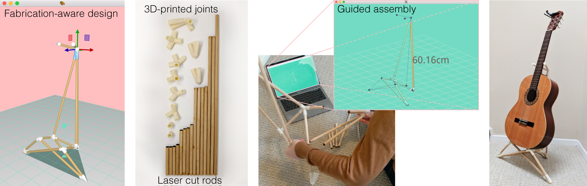

title: RodSteward: A Design-to-Assembly System for Fabrication using 3D-Printed Joints and Precision-Cut Rods
author: Alec Jacobson
html header: <meta property="og:image" content="http://www.dgp.toronto.edu/projects/rodsteward/teaser.jpg" />
<meta property="og:description" content="We present RodSteward, a design-to-assembly system for creating furniture-scale structures composed of 3D-printed joints and precision-cut rods.  The RodSteward systems consists of: RSDesigner, a fabrication-aware design interface that visualizes accurate geometries during edits and identifies infeasible designs; physical fabrication of parts automatically generated 3D-printable joint geometries and cutting plans for rods; and RSAssembler, a guided-assembly interface that prompts the user to place parts in order while showing a focus+context visualization of the assembly in progress.  We demonstrate the effectiveness of our tools with a number of example constructions of varying complexity, style and parameter choices." />
<meta name="twitter:card" content="summary"></meta>
<meta name="og:title" content="RodSteward: A Design-to-Assembly System for Fabrication using 3D-Printed Joints and Precision-Cut Rods"></meta>
css: style.css

# RodSteward:<br>A Design-to-Assembly System for Fabrication using 3D-Printed Joints and Precision-Cut Rods _Pacific Graphics 2019_

<div class=authors>

Alec Jacobson

University of Toronto

</div>



## Abstract
We present _RodSteward_, a design-to-assembly system for creating furniture-scale structures composed of 3D-printed joints and precision-cut rods.  The RodSteward systems consists of: _RSDesigner_, a fabrication-aware design interface that visualizes accurate geometries during edits and identifies infeasible designs; physical fabrication of parts automatically generated 3D-printable joint geometries and cutting plans for rods; and _RSAssembler_, a guided-assembly interface that prompts the user to place parts in order while showing a focus+context visualization of the assembly in progress.  We demonstrate the effectiveness of our tools with a number of example constructions of varying complexity, style and parameter choices.

## Downloads
 - [Paper](rodsteward-pacific-graphics-2019-jacobson.pdf)
 - [Paper (low res)](rodsteward-pacific-graphics-2019-compressed-jacobson.pdf)
 - [ArXiv](http://arxiv.org/pdf/1906.05710v1.pdf)
 - [Video](rodsteward.mp4)

## Video

<iframe width="560" height="315" src="https://www.youtube.com/embed/8qd8jtqYFUY" frameborder="0" allow="accelerometer; autoplay; encrypted-media; gyroscope; picture-in-picture" allowfullscreen></iframe>

## BibTeX

```
@article{JacobsonRodSteward2019,
  title = {RodSteward: A Design-to-Assembly System for Fabrication using 3D-Printed Joints and Precision-Cut Rods},
  author = {Alec Jacobson},
  year = {2019},
  journal = {Computer Graphics Forum}, 
}
```

## Acknowledgements 

This research is funded in part by NSERC Discovery (RGPIN2017–05235,
RGPAS–2017–507938), New Frontiers of Research Fund (NFRFE–201), the Ontario
Early Research Award program, the Canada Research Chairs Program, the Fields
Centre for Quantitative Analysis and Modelling and gifts by Adobe Systems,
Autodesk and MESH Inc.  We are grateful to Tovi Grossman, Fanny Chevalier,
Zhicong Lu, Sarah Kushner, Leo Sacht and Eitan Grinspun for feedback on drafts
of this paper.  We thank David Levin for illuminating discussions and John
Hancock for infrastructural support.

<!-- `multimarkdown --process-html -o index.{html,md}` -->
